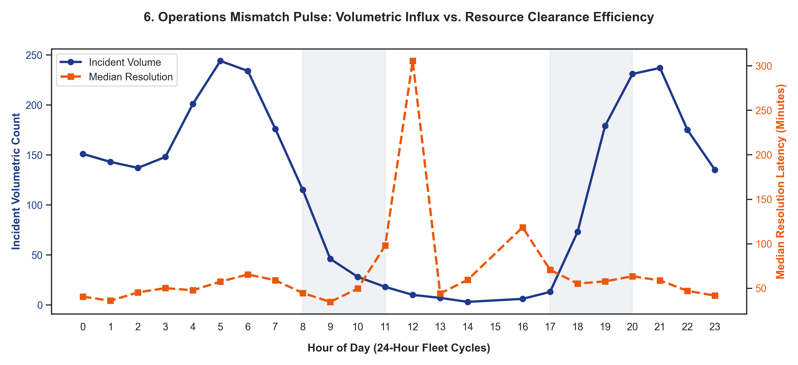
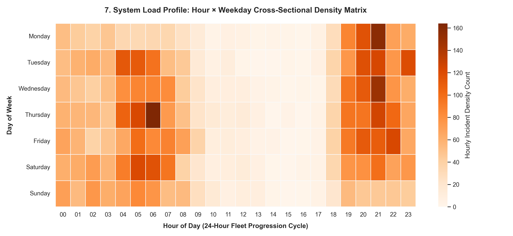
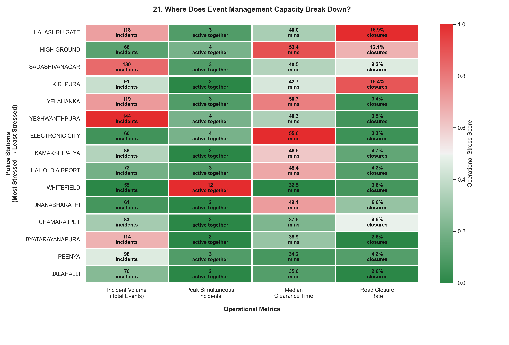
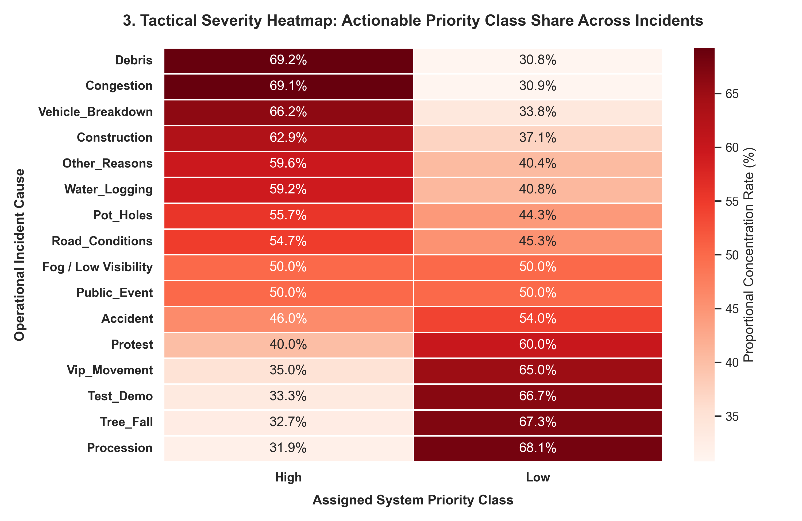

# EventGuard: Bengaluru Traffic Command Control & Resource Allocation System

EventGuard is an advanced predictive resource allocation system and dynamic digital twin designed to mitigate event-driven and unplanned traffic gridlocks in Bengaluru. The platform provides real-time predictive triage, resource optimization, and pathfinding by combining OpenStreetMap street network graphs, live incident logging pipelines, and empirical traffic priors from historical GPS probe data.

---

## 🚀 System Architecture & Key Components

1. **Live Incident Predictor (`app.py`, `model.py`)**:
   - Uses a soft-voting `VotingClassifier` ensemble of optimized **LightGBM** and **CatBoost** classifiers to predict whether an active incident will result in a **High Impact (>120 mins)** or **Low Impact (<30 mins)** clearance window.
   - Evaluates with an overall classification accuracy of **85.49%** (Macro F1 of **0.8448**) on the chronological split.
   - Features target-encoded `junction_risk` tracking.

2. **Resource Allocation Engine (`recommendation_engine.py`)**:
   - Formulates and solves a multi-objective fractional knapsack problem via **PuLP linear programming** to dynamically allocate scarce police and barricade supplies when concurrent traffic gridlocks exceed local station capacities.
   - Snaps coordinates dynamically to identify high-friction spatial zones using rolling haversine density counts.

3. **Route Optimizer & Digital Twin (`digital_twin.py`)**:
   - Merges OpenStreetMap city network graphs with a 4-month matrix of observed GPS velocity logs and probe density indicators.
   - Computes dynamic route cost updates under active incident shockwaves (using Dijkstra and A* pathfinding) to guide emergency dispatches to incident epicenters.

---

## 📈 Exploratory Data Analysis (EDA) Insights

Here are the key structural findings extracted from the 4-month historical incident registry:

### 1. Hourly Operations Pulse & Peak Commuting Shockwaves
This dual-axis temporal trend visualizes how incident volume spikes concurrently with peak commute windows (8:00–11:00 AM and 5:00–8:00 PM), while showing the average clearance timeline (minutes) across the operational day.



### 2. Chronological Profile (Weekday × Hour Density Heatmap)
A detailed heatmap matrix mapping incident volume concentration across weekdays and hours. This highlights localized congestion bottlenecks and recurring patterns, such as severe weekend evening traffic.



### 3. Resource Pressure & Concurrency Matrix
This composite matrix scales ground-level concurrency demands across the 15 highest-burden police jurisdictions. It identifies localized resource saturation (such as in Whitefield) where incident concurrency exceeds baseline station supply.



### 4. Priority × Event Cause Severity Matrix
Normalizing categorical priorities across specific event causes shows that "High Priority" classifications carry massive internal clearance variances. This justifies BTP's shift toward multi-objective predictive triage over simple priority labels.



---

## ⚙️ Installation & Usage

### Prerequisites
Ensure Python (3.9–3.12) is installed. Install required packages using `pip`:

```bash
pip install streamlit pandas numpy scikit-learn xgboost lightgbm catboost joblib osmnx networkx folium streamlit-folium pyproj pulp scipy matplotlib seaborn
```

### Running the Application
Launch the Streamlit dashboard locally:

```bash
streamlit run app.py
```

Streamlit will boot up a local server (default: `http://localhost:8501`) mapping the following navigation panes:
- **🔍 Live Predictor**: Ingest real-time incident features, evaluate impact, and add incidents to the queue.
- **📊 Batch Optimizer**: Upload incident CSVs to solve the linear programming station resource allocation problem.
- **🗺️ Route Optimizer**: Set origin/destination targets on the OSM graph to compare Dijkstra and A* paths under dynamic incident penalties.
- **📈 EDA Dashboard**: View interactive temporal trends and pre-compiled visual diagnostics.
- **🗺️ Incident Map**: Visualize incident spatial coordinates dynamically via heatmaps.
